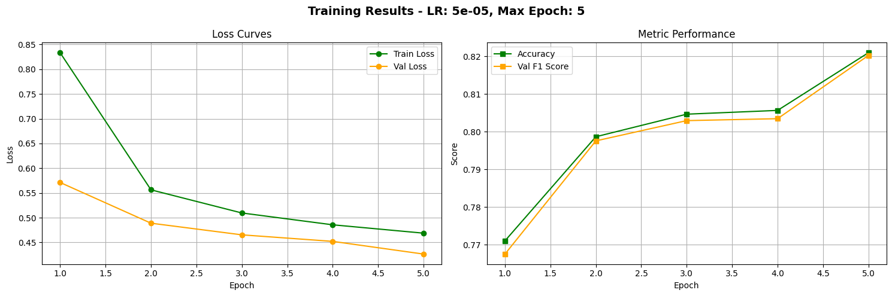
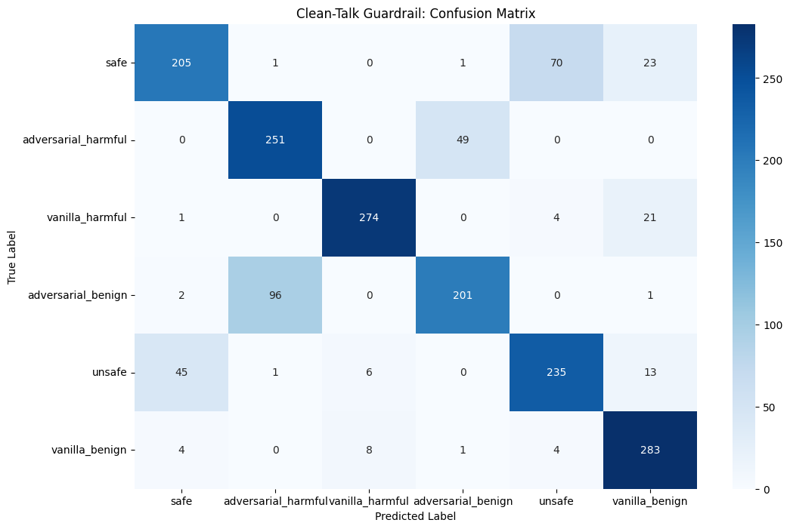

# Clean Talk: Guardrail API

A safety guardrail system that classifies prompts and evaluates policy compliance. Takes a prompt and determines if it's safe or attempting a jailbreak, then retrieves relevant policies and judges whether the content complies with safety or usage guidelines to reduce off-topic prompts.

Possible use cases: 
1. Preventing misuse of AI chatbots by limiting filtering prompts sent to the LLM.
2. Moderating ChatBot behaviour by filtering prompts using chosen policies.

(add video here)

## Table of Contents
- [Overview](#overview)
- [Model Performance](#model-performance)
- [Features](#features)
- [Setup](#setup)
- [Usage](#usage)
- [Docker & Deployment](#docker--deployment)
- [Project Structure](#project-structure)
- [API Documentation](#api-documentation)
- [Tools & Technologies](#tools--technologies)
- [Remarks](#remarks)

## Overview

Clean Talk is a two-stage safety evaluation system:

1. **Classifier (DistilBERT)** - Classifies prompts into 6 categories:
   - `safe` - Safe and benign prompts
   - `adversarial_harmful` - Adversarial attacks attempting to cause harm
   - `vanilla_harmful` - Directly harmful prompts without adversarial framing
   - `adversarial_benign` - Adversarial attacks on benign topics
   - `unsafe` - Unsafe prompts
   - `vanilla_benign` - Benign prompts without adversarial intent

   Trained on a combination of these 2 datasets: [nvidia/Aegis-AI-Content-Safety-Dataset-2.0](https://huggingface.co/datasets/nvidia/Aegis-AI-Content-Safety-Dataset-2.0) & [allenai/wildjailbreak](https://huggingface.co/datasets/allenai/wildjailbreak)

2. **Judge LLM (RAG + Gemini)** - Uses RAG with Pinecone vector database to retrieve relevant policies and evaluate compliance via Google Gemini.

## Model Performance

### Training Results
The DistilBERT classifier was trained with strong performance metrics:



- **Final Accuracy:** 82% on validation set
- **Final F1 Score:** 82% 
- **Training Loss:** Converged from 0.84 → 0.47
- **Learning Rate:** 5e-05, Max Epoch: 5

### Confusion Matrix
The model shows excellent performance across all 6 safety categories:



- Strong diagonal values indicate high accuracy per class
- Clear distinction between safety categories
- Few misclassifications across categories

## Features

- ✅ Real-time prompt classification using DistilBERT
- ✅ Confidence scores for predictions
- ✅ FastAPI backend for easy integration
- ✅ Streamlit web interface with policy management
- ✅ RAG-based policy evaluation using Pinecone & Google Gemini
- ✅ Dynamic custom policy creation and storage
- ✅ Docker support

## Setup

### 1. Clone and Create Virtual Environment

```bash
python -m venv venv
source venv/bin/activate  
```


### 2. Set up your environment variables.
Copy `.env.example` to `.env` and fill in the given variables.

### 3. Install Dependencies

```bash
pip install -r requirements.txt
```

### 4. Prepare the Model

Train your model by running the notebook:
```bash
jupyter notebook notebooks/02_training.ipynb
```

Then save your trained model to:
```
models/best_model.pt
```

Alternatively, download my pre-trained model from this [link](https://drive.google.com/file/d/1dD4TYrJAgo1Kn0_sZWY1hW6w5saTLYav/view?usp=share_link) and place it in the `models/` directory.

### 5. Set up Pinecone RAG
Run the notebook `notebooks/03_setup_rag.ipynb` to initialize Pinecone and seed initial policies (you can also add policies directly through the Streamlit interface).

## Usage

### Running the API

Start the FastAPI backend on `http://localhost:8000`:
```bash
python src/api/main.py
```

The API will be available at: http://localhost:8000/docs (Swagger UI)

Alternatively, using uvicorn directly:
```bash
uvicorn src.api.main:app --reload --host 0.0.0.0 --port 8000
```

### Running the Streamlit App

In a new terminal (ensure API is running), start the Streamlit frontend:
```bash
streamlit run src/app.py
```

The app will be available at: http://localhost:8501

**Features:**
- **Prompt Classification** - Enter a prompt to get instant safety classification
- **Sample Prompts** - Choose from pre-loaded test prompts to explore the system
- **Policy Management** - Add new safety policies via the sidebar
- **Current Policies** - View all stored policies
- **Policy Compliance Check** - Automatically validates prompts against stored policies using RAG

### Streamlit Cloud Deployment

For deployment to [Streamlit Cloud](https://streamlit.io/cloud) without a separate backend:

```bash
streamlit run src/streamlit.py
```

`streamlit.py` combines the FastAPI backend and Streamlit frontend into a single file. Deploy by pushing to GitHub and selecting `src/streamlit.py` as the main file in Streamlit Cloud.

Note: Model has not been committed to the repository!

## Docker

### Running with Docker

```bash
docker-compose up --build
```

Starts backend API on `http://localhost:8000` and frontend on `http://localhost:8501`.

**Docker Files:**
- `Dockerfile.api` - Backend FastAPI container
- `Dockerfile.app` - Frontend Streamlit container
- `docker-compose.yml` - Orchestrates both services

### Google Cloud Deployment

You can also deploy directly to Google Cloud Run by connecting the GitHub repository.

Note: The model is not included in the Dockerfile!

## Project Structure

```
clean-talk/
├── Dockerfile.api             # Backend API container configuration
├── Dockerfile.app             # Frontend Streamlit container configuration
├── docker-compose.yml         # Docker Compose orchestration (runs both services)
├── .dockerignore              # Files excluded from Docker containers
│
├── README.md                  # This file
├── requirements.txt           # Python dependencies            
│
├── models/
│   └── best_model.pt          # Trained model checkpoint
│
├── notebooks/
│   ├── 01_data_exploration.ipynb   # EDA and data analysis
│   ├── 02_training.ipynb           # Model training
│   └── 03_setup_rag.ipynb          # Pinecone DB set up
│
├── reports/
│   ├── experiment_logs/       # Training logs and metrics
│   ├── diagrams/              # Training metrics visualisation
│   └── api_log.csv            # Log of all API requests 
│
└── src/
    ├── api/
    │   └── main.py            # FastAPI application
    ├── core/
    │   ├── classifier.py      # DistilBERT model inference
    │   ├── features.py        # Feature engineering utilities
    │   └── safety_rag.py      # RAG pipeline with Pinecone & Gemini
    ├── app.py                 # Streamlit frontend with separate backend
    ├── streamlit.py           # Streamlit with integrated API (for Cloud deployment)
    └── utils/
        ├── api_logger.py      # API request/response logging
        ├── logger.py          # Training logger
        └── helper.py          # Utility functions
```

## API Documentation

### Endpoints

#### `GET /`
Health check endpoint.

**Response:**
```json
{
  "message": "Prompt Classification API is running"
}
```

#### `POST /classify`
Classify a prompt using the DistilBERT model and return safety classification with confidence score.

**Request:**
```json
{
  "prompt": "string"
}
```

**Response:**
```json
{
  "prompt": "string",
  "classification": "string (one of: safe, adversarial_harmful, vanilla_harmful, adversarial_benign, unsafe, vanilla_benign)",
  "confidence": "float (0.0 to 1.0)"
}
```

#### `POST /policy_check`
Evaluate prompt compliance against stored policies using RAG (Retrieval-Augmented Generation). 

**Request:**
```json
{
  "prompt": "string"
}
```

**Response:**
```json
{
  "decision": "string (VIOLATION or NOT A VIOLATION)",
  "policy": "string (the relevant policy that was checked)",
  "response_to_user": "string (detailed explanation)"
}
```

#### `POST /add_policy`
Add a new safety policy to the Pinecone vector database. 

**Request:**
```json
{
  "policy": "string"
}
```

**Response:**
```json
{
  "id": "string",
  "text": "string",
  "status": "uploaded"
}
```

## Tools & Technologies

### Core Libraries
- **PyTorch** - Deep learning framework
- **Transformers** - Hugging Face model library
- **DistilBERT** - Fast, lightweight BERT model
- **FastAPI** - Modern web framework
- **Streamlit** - Interactive web app framework
- **Uvicorn** - ASGI server for FastAPI

### Data & ML
- **Pandas** - Data manipulation
- **Scikit-learn** - ML utilities
- **Matplotlib & Seaborn** - Visualization
- **Datasets** - Hugging Face datasets library for loading training data


### RAG & LLM
- **Pinecone** - Vector database for policy storage and retrieval
- **Sentence-Transformers** (all-MiniLM-L6-v2) - Embedding generation for semantic search
- **Google Gemini** - LLM for policy evaluation and judgment


## Remarks
This is an exploratory project. The aim of this project is to learn tools and frameworks that are commonly used in AI.